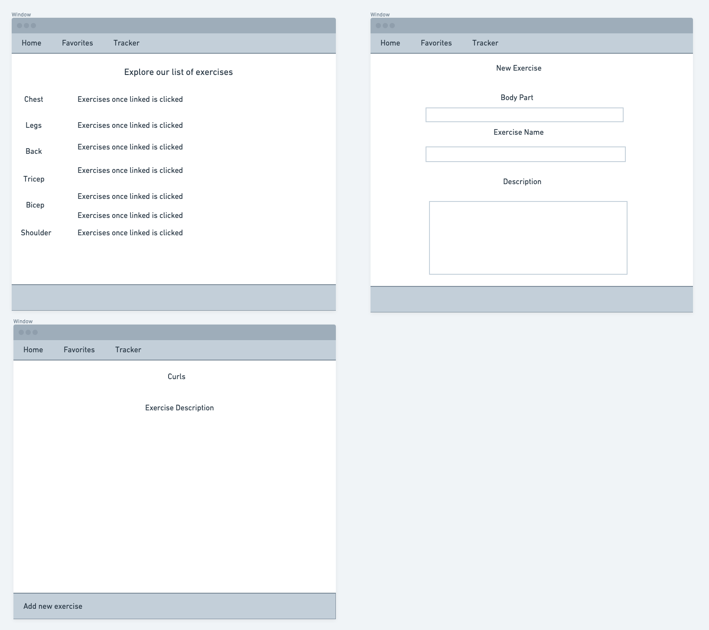
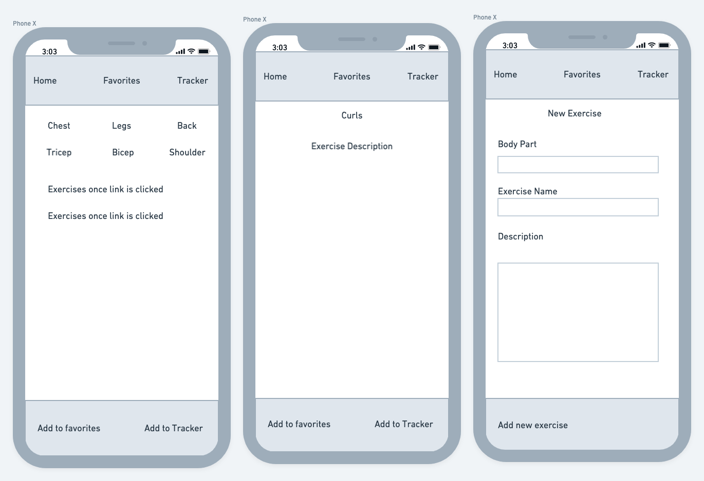
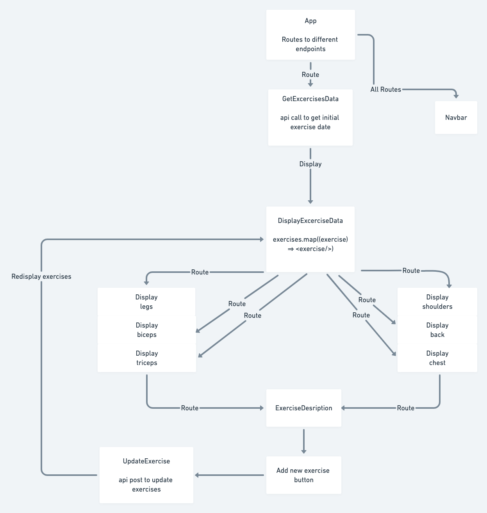

# Project Overview

## Project Name

Athletic Performance Index (API)

## Project Description

This application provides a list of exercises, broken up by different body parts, allows the user to add specific exercises to a favorites list, and track previous exercises and frequencies. 

## Wireframes




## Component Hierarchy



## API and Data Sample

```json
{
     "records": [
        {
            "id": "recdf3lFxdfXE4gae",
            "fields": {
                "name": "Bench Press"
            },
            "createdTime": "2022-01-07T16:18:02.000Z"
        },
        {
            "id": "recGPBC16NKfQ2GWt",
            "fields": {},
            "createdTime": "2022-01-07T16:18:02.000Z"
        },
        {
            "id": "recQUzabuiH6JSIQC",
            "fields": {},
            "createdTime": "2022-01-07T16:18:02.000Z"
        }
    ],
    "offset": "itr9oERfR2Lzff81T/recQUzabuiH6JSIQC"
}
{
   "records": [
        {
            "id": "recJDIbj7SCUrUgU9",
            "fields": {
                "back": "Deadlifts",
                "chest": "Flat Bench",
                "shoulders": "Military Press",
                "biceps": "Curls",
                "triceps": "Skull Crusher",
                "legs": "Leg Presses"
            },
            "createdTime": "2022-01-07T16:09:02.000Z"
        },
        {
            "id": "recuarsmwyTwY2hBN",
            "fields": {
                "back": "Cable Rows",
                "chest": "Incline bench",
                "shoulders": "Front Raises",
                "biceps": "Hammer Curls",
                "triceps": "Tricep Pull Downs",
                "legs": "Squats"
            },
            "createdTime": "2022-01-07T16:09:02.000Z"
        },
        {
            "id": "recDXbG7onDHDtnPU",
            "fields": {
                "back": "Bent Over Rows",
                "chest": "Decline Bench",
                "shoulders": "Side Raises",
                "biceps": "Preacher Curls",
                "triceps": "Close Grip Benching",
                "legs": "Box Squats"
            },
            "createdTime": "2022-01-07T16:09:02.000Z"
        }
    ],
    "offset": "itrMGr6yXKRcaT4iO/recDXbG7onDHDtnPU"
}
```

### MVP/PostMVP
#### MVP 

- Create Air Table Api for exercises 
- All routes/endpoints are functional
- All endpoints have styled and displayable data
- Diplay data for each body part
- Update button
- Form to submit new exercise
- Descriptions for exercises or links to description or video of exercises

#### PostMVP  

- Likes button functionality for exercises
- Top 5 liked section for each body part
- Additional Styling
- Top 5 like exercises all time on home page
- Restyle top 5 display form

## Project Schedule

This schedule will be used to keep track of your progress throughout the week and align with our expectations. Here's an example.

|  Day | Deliverable | Status
|---|---| ---|
|July 10-12| Prompt / Wireframes / Priority Matrix / Timeframes | Complete
|July 13| Project Approval | Incomplete
|July 13| Core Application Structure (HTML, CSS, etc.) | Incomplete
|July 14| Pseudocode / actual code | Incomplete
|July 15| Initial Clickable Model  | Incomplete
|July 16| MVP | Incomplete
|July 17| Presentations | Incomplete

## Timeframes


| Component | Priority | Estimated Time | Time Invested | Actual Time |
| --- | :---: |  :---: | :---: | :---: |
| Navbar Routes | H | 1hr|  |  |
| Fetching homepage data | H | 2hr| | |
| Display homepage data | H | 2hrs|  |  |
| Styling for homepage | H | 4hrs|  |  |
| Routes for each bodypart | H | 2hrs|  |  |
| Fetching for each body part | H | 4hrs|  |  |
| Display for each body part | H | 4hrs|  |  |
| Styling for each body part page | H | 4hrs|  |  |
| Add new exercise button| H | 2hrs|  |  |
| Form for new exercise| H | 3hrs|  |  |
| Styling for new exercise form| H | 3hrs|  |  |
| Likes button| H | 3hrs|  |  |
| Increment likes component| H | 3hrs|  |  |
|Top 5 display for each body part| L | 4hrs|  |  |
|Top 5 display for home page| L | 4hrs|  |  |
|Style top 5 display| L | 4hrs|  |  |
| Total | H | 49hrs|  | |

## SWOT Analysis

### Strengths:

Javascript functions and react component functionality.

### Weaknesses:

Css styling.

### Opportunities:

Creating a fully functional and reactive react application.

### Threats:

Getting all the components and styling completed on time for presentation.